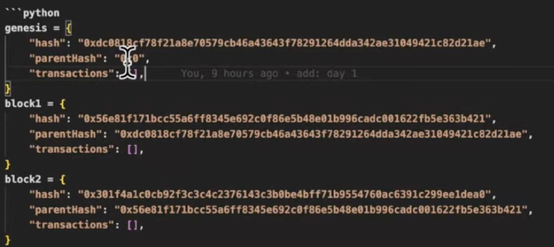

### Sumário

1. 🪪 Wallet
    1. Funções de Hash
    2. Chaves Públicas
    3. UTXO
    4. Account-Based
2. 🔁 Transações
    1. Ciclo de vide de uma Tx
    2. Taxas
3. 🧱 Blocos
    1. Criando uma Blockchain
    2. O que é Merkle Tree
4. 🤝 Consenso
    1. Proof-of-Work
    2. Proof-of-Stake
    3. Proof-of-Authority

## 🪪 Wallet 

### Funções Hash / Hash Functions

Função Deterministica  - significa que sempre que você passar a mesma entrada por uma função hash específica você obtera o mesmo valor como saída, independente de quantas vezes você executar a função.

- Rapidas de calcular
- Impraticáveis de inverter ( se um hash for colocad
- Resistentes a colisões ( o resultado nao pode ser o mesmo pra dois itens)
- Efeito avalanche (se o objeto do hash muda , ele muda )
- Fixo em tamanho de saída ( mesmo tamanho de hash )
- Pseudorrandomização

### **Chaves Públicas**

Método da criptografia que usa um par de chaves para segurança de dados. 

O método consiste em uma chave pública e uma chave privada que são matematicamente relacionadas entre elas.

A mensagem criptografada com a chave pública só pode ser descriptografada com a chave privada correspondente, que é mantida em segredo.

No blockchain a chave pública é transformada por meio do algoritmo hash para gerar o endereço da carteira.


### UTXO

Unspent Transaction Output -   Utilizada em blockchains como o Bitcoin é um conceito de como rastrear a propriedade e movimento das unidades da criptomoeda neste tipo de rede.

UTXO - Cada UTXO representa uma quantidade especifica recebida em um endereço de carteira e que ainda não foi gasto. Pense em UTXO como notas ou moedas de uma carteira física. Similar a uma carteira física só podem ser gastos uma vez.


Quando uma transação é feita em uma blockchain baseada no UTXO, você usa um ou mais UTXOs como entrada para criar a transação. Esses UTXOs são processados e transformados em novos UTXOs que são enviados aos endereços de destino, para representar no fim a quantidade de criptomoeda transferida.

Ao final uma transação na blockchain pega UTXOs existentes como entradas , os gasta, e cria novos UTXOs como saídas que podem ou não ser destinadas a diferentes endereços. Inclusive de volta ao remetente da transação como "troco” se a quantidade exceder o valor transferido.

O saldo de criptomoedas neste tipo de rede é calculado somando todos os UTXOs recebidos por um endereço e não gastos.

**Assinaturas Digitais** : Para gastar UTXOs o proprietário precisa provar sua propriedade da criptomoeda, assinando a transação com a chave privada correspondente a chave pública (ou endereço) para o qual o UTXO foi emitido. Isso garante que apenas o proprietário possa gastar as UTXOs


### Account-Base

Abordagem alternativa ao UTXO, adotada por plataformas como a Ethereum.

A rede mantém um registro do saldo atual além de outras informações relevantes. Este saldo é atualizado a cada transação.


## 🔁 Transações (Tx)


### Ciclo de Vida de uma Transação (Tx)


Uma transação simples tem

“from” , “to” e “value”

"from” : eu

“to”: pra quem estou enviando

“value”: valor que estou enviando

“nonce”:  “número de transferencia da transação” usado para evitar transacao duplicado. Também serve para prioridade para transação.

“chainId” : indica qual cadeia está sendo usada. (ethereum, polygon, ethereum test net)

Ciclo de vida da transação: 

1- Escreve transação

2- Assina transação

3 - Envia transação (via api)

### Taxas

- Modelo Legacy - Gas , gasPrice, gasLimit
- Modelo Atual - maxFeePerGas, maxPriorityFeePerGas

Gas - quantidade de esforço computacional necessário para executar operações , determinado pelo mercado com base na demanda atual.

Modelo Legacy - envio da taxa nas transações antigamente: 

Gas = Quantidade

gasPrice = preço da taxa

gasLimit = limite que você está disposto a pagar pela transação

Modelo Atual: 

maxFeePerGas =  Máximo de taxa que o remetente está disposto a pagar por unidade de gás

maxPriorityFeePerGas = Gorjeta ou taxa de prioridade que um usuário está disposto a pagar para os mineiradores.

## 🧱 Blocos

### Anatomia de um bloco

Bloco Genesis - Unico bloco sem parent. é o bloco gerador da blockchain, ou bloco 0.

Hash - identificaçao do bloco atual

parentHash - hash do bloco anterior (para construir a cadeia de blocos

Transactions - lista de transações

```python
blockchain = [genesis, block1,block2,block3]
```

O blockchain é uma linkedlist ou lista encadeada.


### Criando uma BlockChain


### Oque é Merkle Tree

Algoritmo usado para agrupar os dados (no caso as transações) em pares e calculando o hash de cada par até que reste apenas um hash. Ela é uma forma eficiente de resumir as transações de um bloco em um hash só - o root . Isso simplifica a verificação dos dados da transação pois você apenas verifica a Merkle Root ao invés de cada transação.

## 🤝 Consenso


### Proof-of-Work

Mineração

Precisa de poder computacional para identificar o validador.

Hash do bloco o nonce do bloco até gerar o hash do bloco . Ao gerar o bloco o minerador é recompensado

### Proof-of-Stake

“Precisa do dinheiro” ao invés do poder computacional. Escolhe quem tem a moeda da rede para validar e por isso é mais democrático

### Proof-of-Authority

Rede centralizada geralmente construida por empresas (blockchains privadas).
O validador é escolhido a dedo e por isso é mais eficiente em questão de energia gasta (se comparar com PoW e PoS) 